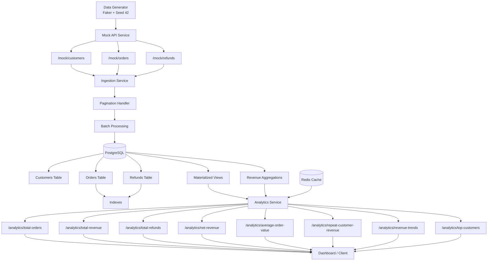

# E-Commerce Analytics Backend Service

## Overview

A high-performance backend analytics platform built with **Python, FastAPI, PostgreSQL, Redis, and Docker**. The system simulates a real-world e-commerce data pipeline by generating large-scale datasets, exposing paginated mock APIs, ingesting millions of records into PostgreSQL, and serving business analytics with sub-2-second response times.

This project was designed to demonstrate backend engineering concepts including data ingestion, API design, database optimization, caching, materialized views, batch processing, and scalable analytics architecture.

## Project Walkthrough Video

A complete walkthrough of the system architecture, ingestion pipeline, analytics APIs, database design, caching strategy, and load testing results.

🎥 Loom Demo:
https://www.loom.com/share/8f82249702db4ef5a9e4c9ea1654cba5

## Dataset Scale

* **100,000 Customers**
* **1,000,000 Orders**
* **200,000 Refunds**
* **1.3 Million Total Records**

All datasets are generated using a fixed random seed to ensure reproducibility across environments.

---

## Technology Stack

| Component         | Technology   |
| ----------------- | ------------ |
| Backend Framework | FastAPI      |
| Language          | Python 3.10+ |
| Database          | PostgreSQL   |
| Cache             | Redis        |
| ORM               | SQLAlchemy   |
| Async HTTP Client | HTTPX        |
| Data Generation   | Faker        |
| Containerization  | Docker       |
| Load Testing      | Locust       |

---

## Features

## Data Generation

* Deterministic dataset generation using Faker.
* Fixed seed for reproducibility.
* Generates customers, orders, and refunds at scale.

## Mock APIs

* Paginated endpoints.
* Supports efficient ingestion.
* Simulates external data providers.

## Ingestion Pipeline

* Handles API pagination automatically.
* Async batch processing.
* Efficient bulk insertion into PostgreSQL.

## Analytics APIs

* Total Orders
* Total Revenue
* Total Refunds
* Net Revenue
* Average Order Value (AOV)
* Repeat Customer Revenue
* Revenue Trends
* Top Customers by Spend

## Performance Optimization

* PostgreSQL indexing on critical columns.
* Materialized Views for heavy aggregations.
* Redis caching for frequently accessed metrics.
* Optimized SQL queries and async processing.

---
## Setup Instructions
* Clone Repository

```bash
git clone https://github.com/vanshjayswal08-byte/ecommerce-analytics.git
cd ecommerce-analytics
```
* Install Dependencies
```bash
pip install -r requirements.txt
```
* Run Using Docker
```bash
docker compose up -d --build
```
* Access API Docs
http://localhost:8000/docs

## API Endpoints

## Mock APIs

```http
GET /mock/customers
GET /mock/orders
GET /mock/refunds
```

## Analytics APIs

```http
GET /analytics/total-orders
GET /analytics/total-revenue
GET /analytics/total-refunds
GET /analytics/net-revenue
GET /analytics/average-order-value
GET /analytics/repeat-customer-revenue
GET /analytics/revenue-trends
GET /analytics/top-customers
```

Interactive API documentation is available at:

```http
http://localhost:8000/docs
```

---

## Performance

The system is designed to handle over **1.3 million records** while maintaining analytics response times below **2 seconds** through:

* Database indexing
* Redis caching
* Materialized Views
* Async processing
* Batch ingestion


## Analytics Performance Proof


---

## Running the Project

```bash
docker compose up -d --build
```

Access:

```text
API Docs : http://localhost:8000/docs
PostgreSQL : localhost:5432
Redis : localhost:6379
```
## Architecture Diagram
# System Architecture



## Swagger Documentation


## Load Testing Results 


---
## Architecture & Optimization Decisions

# Architecture

The application follows a scalable pipeline architecture:

Data Generator → Mock APIs → Ingestion Service → PostgreSQL → Redis Cache + Materialized Views → Analytics APIs

# Optimization Decisions

To ensure analytics responses remain below 2 seconds on a dataset containing over 1.3 million records, the following optimizations were implemented:

* PostgreSQL indexes on frequently queried columns such as `customer_id`, `order_id`, and `created_at`.
* Batch ingestion to reduce database write overhead.
* Redis caching for frequently accessed analytics metrics.
* Materialized Views for expensive aggregation queries like Top Customers by Spend.
* Async FastAPI endpoints and HTTP clients for improved concurrency.
* Pagination support to efficiently process large datasets.
* Deterministic dataset generation using a fixed random seed for reproducibility.


## Author

**Vansh Jayswal**

Backend Developer | Python Developer

GitHub: https://github.com/vanshjayswal08-byte

LinkedIn: https://linkedin.com/in/vanshjayswal08
